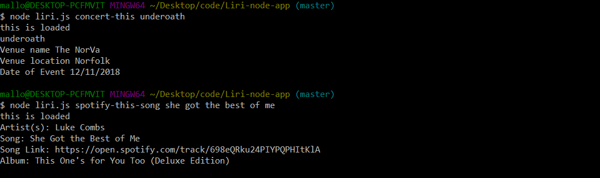

# Liri-node-app

This app will take in commands and give out information based on those commands. 

Command list:
    - "spotify-this-song"
    -"movie-this"
    -"concert-this"

After entering a command, you will then enter your query.
    ex. spotify-this-song all the small things
    ex. movie-this inception
    ex. concert-this garth brooks
Below are a few examples of how it works in the terminal
 example of concert this and spotify this

 example of moviethis

this app is maintained by Caleb Colon
Please reach out with any questions to ccolon105@yahoo.com